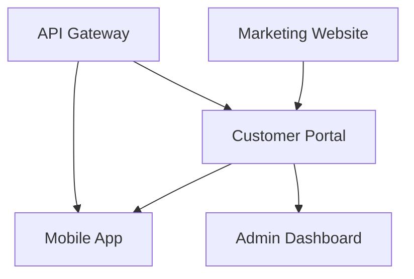

# Product Requirements Document: [Project Name]
**Type**: Master PRD  
**Version**: 1.0  
**Status**: [Draft/In Review/Approved/Locked]  
**Last Updated**: [Date]

## Document References
- **Brand Guidelines**: [PRD_Branding.md](./PRD_Branding.md)
- **Entity Information**: [PRD_Entity.md](./PRD_Entity.md)
- **Asset PRDs**: [To be added based on project structure]
  <!-- Examples of asset PRD naming:
  - PRD_[AssetName].md - where AssetName describes the deliverable
  - PRD_CustomerPortal.md - for a customer-facing portal
  - PRD_AdminDashboard.md - for an administrative interface
  - PRD_MobileApp.md - for mobile applications
  - PRD_API.md - for API specifications
  - PRD_DataPipeline.md - for backend data systems
  Asset PRDs will be created as needed during discovery -->

## Executive Summary
[NEEDS ATTENTION: Brief overview of the entire product ecosystem, its purpose, and key value proposition across all assets]

## Purpose & Mission

### Problem Statement
[CRITICAL NEED: What problem does this solve? This drives everything else]

### Mission
[CRITICAL NEED: Core mission and vision - defines project direction]

### Unique Value Proposition
[NEEDS ATTENTION: What makes this solution unique compared to alternatives?]

## Target Audience

### Primary Users
- [User segment 1]
- [User segment 2]

### Secondary Users
- [User segment 1]
- [User segment 2]

### User Sophistication
[Technical level, domain expertise expected]

### Geographic Scope
[Local, regional, national, global]

## Product Architecture

### Asset Overview
[CRITICAL NEED: Describe the overall product ecosystem and how assets work together]

<!-- Asset list will be populated during discovery based on project needs
Examples of common assets:
- Customer-facing applications (web portals, mobile apps)
- Administrative interfaces (dashboards, control panels)
- Marketing properties (websites, landing pages)
- Backend services (APIs, data pipelines)
- Developer tools (SDKs, documentation sites)

For each identified asset, create entry:
1. **[Asset Name]**
   - Purpose: [Primary function in the ecosystem]
   - Target Users: [Who uses this asset]
   - Key Features: [High-level capabilities]
   - PRD Reference: PRD_[AssetName].md
-->

### Asset Relationships
[CRITICAL NEED: How do the assets interact and depend on each other?]

### Shared Infrastructure
- **Authentication System**: [Shared across which assets]
- **Data Platform**: [Common data layer]
- **API Services**: [Shared backend services]
- **Design System**: [Shared UI components]

## Core Features (Cross-Asset)

<!-- SPEC-KIT READINESS GUIDANCE:
For optimal specification generation with spec-kit, features should be:
✓ Concrete and specific (avoid vague terms like "manage" or "handle")
✓ User-focused (describe what users can do, not how system works)
✓ Properly scoped (each feature should be implementable in 1-2 sprints)
✓ Measurable (clear success criteria should be derivable)

GOOD Examples:
- "Users can create, edit, and delete personal task lists with due dates"
- "Administrators can configure role-based access controls for team members"
- "System sends automated email notifications for overdue tasks"

POOR Examples:
- "Task management" (too vague)
- "Handle user data efficiently" (not concrete)
- "Better user experience" (not measurable)

Target: Define at least 2-3 concrete features for spec-kit to process effectively
-->

### Company-Level Features
[Features that span multiple assets or define the overall product]

1. **Single Sign-On (SSO)**
   - Affects: All authenticated assets
   - Description: Unified authentication across ecosystem

2. **Unified User Profile**
   - Affects: Portal, Mobile App, Admin
   - Description: Consistent user data across platforms

### Asset-Specific Features
[High-level summary - details in individual asset PRDs]

- **Portal Features**: See [PRD_Portal.md](./PRD_Portal.md)
- **Website Features**: See [PRD_Website.md](./PRD_Website.md)
- **Mobile Features**: See [PRD_MobileApp.md](./PRD_MobileApp.md)

### Non-Goals (Company Level)
- We will NOT [explicitly excluded feature across all assets]
- We will NOT [explicitly excluded scope]

## Technical Requirements

<!-- SPEC-KIT TECHNICAL GUIDANCE:
Spec-kit needs concrete technical details to generate accurate specifications.
Include specific:
✓ Programming languages and versions (e.g., Python 3.11, Node.js 20)
✓ Frameworks and libraries (e.g., FastAPI, React 18)
✓ Database systems (e.g., PostgreSQL 15, Redis)
✓ API protocols (REST, GraphQL, gRPC)
✓ Infrastructure requirements (Docker, Kubernetes, serverless)
✓ Performance constraints (response times, throughput)
✓ Security requirements (auth methods, encryption)

This helps spec-kit generate appropriate contracts, schemas, and implementation plans.
Minimum: Specify at least 2 technical choices (language + framework or database)
-->

### Performance Requirements
- Response time: [target - e.g., <200ms for API calls]
- Throughput: [target - e.g., 1000 requests/second]
- Availability: [target - e.g., 99.9% uptime]

### Scale Expectations
- Initial users: [number - be specific]
- Growth projection: [timeline]
- Peak load: [estimate]

### Security Requirements
- Authentication: [method]
- Authorization: [model]
- Data protection: [standards]

### Platform Targets
- Primary: [platform]
- Secondary: [platform]
- Mobile: [approach]

## Business Model

### Revenue Streams
1. **[Stream Name]**: [Description and pricing model]
2. **[Stream Name]**: [Description and pricing model]

### Cost Structure
- Development: [estimate]
- Operations: [monthly/annual]
- Marketing: [budget]

### Success Metrics
- [Metric 1]: [target]
- [Metric 2]: [target]
- [Metric 3]: [target]

### Competition Analysis
- **Direct Competitors**: [list]
- **Indirect Alternatives**: [list]
- **Our Differentiation**: [key points]

## Entity Information

### Organization
- Name: [official name]
- Type: [LLC, Corp, Non-profit, etc.]
- Location: [headquarters]

### Team Composition
- Current team: [size and roles]
- Needed expertise: [gaps to fill]

### Existing Resources
- Technical assets: [current systems]
- Intellectual property: [patents, trademarks]
- Partnerships: [existing relationships]

## Standards & Compliance

### Industry Standards
- [Standard 1]
- [Standard 2]

### Regulatory Requirements
- [Regulation 1]
- [Regulation 2]

### Accessibility Requirements
- WCAG Level: [A, AA, AAA]
- Specific needs: [list]

### Quality Benchmarks
- Code coverage: [target]
- Performance benchmarks: [specific metrics]
- User satisfaction: [target score]

## Use Cases

### Primary Use Cases
1. **[Use Case Name]**
   - Actor: [user type]
   - Goal: [what they want]
   - Success: [outcome]

2. **[Use Case Name]**
   - Actor: [user type]
   - Goal: [what they want]
   - Success: [outcome]

### Secondary Use Cases
1. **[Use Case Name]**
   - Actor: [user type]
   - Goal: [what they want]
   - Success: [outcome]

## Constraints & Assumptions

### Constraints
- Budget: [limit]
- Timeline: [deadline]
- Technology: [restrictions]

### Assumptions
- [Assumption 1]
- [Assumption 2]

### Dependencies
- [External system 1]
- [Third-party service 1]

## Success Criteria

### Launch Criteria
- [ ] All MVP features complete
- [ ] Security audit passed
- [ ] Performance targets met
- [ ] Documentation complete

### Post-Launch Success
- [ ] User adoption targets
- [ ] Revenue targets
- [ ] Satisfaction scores
- [ ] Technical metrics

## Approval

**Document Status**: DRAFT
**Last Updated**: [Date]
**Approved By**: [Pending]
**Lock Date**: [When approved]
**Document Hash**: [Generated on lock]